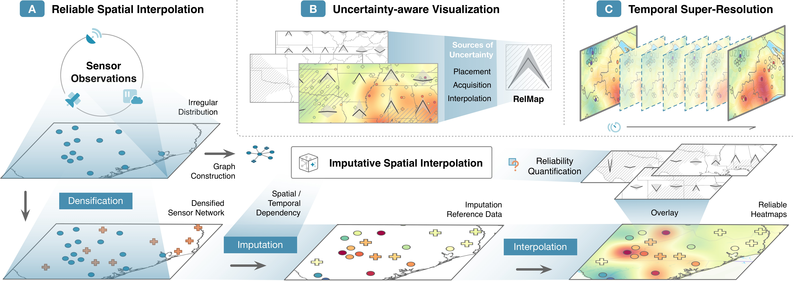
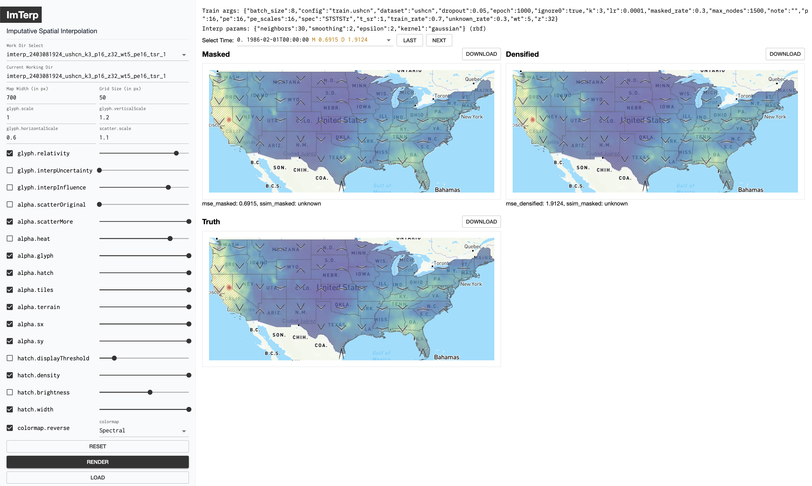

# ImTerp

This is the repository for the paper entitled "Imputative Spatial Interpolation for Spatiotemporal Sensor Data Visualization via Graph Neural Network" submitted for Pacific VIS 2025.



We achieve more accurate and reliable spatial interpolation results using imputation reference data generated by GNNs and encode various uncertainties in the interpolation-based map represnetations.

## Imputation Network Training

Using the `train.py` scripts. The full list of available options include:

```
  --epoch EPOCHq
  --batch_size BATCH_SIZE
  --dropout DROPOUT
  --lr LR               Learning rate (default: 0.0001)
  --dataset DATASET     Dataset, one of ['ushcn', 'uspm25', 'dtaqi', 'catmp'] (default: ushcn)
  --k K                 Top k for spatial convolution layers. (default: 9)
  --z Z                 Hidden space dimension. (default: 24)
  --p P                 Temporal window length. (default: 9)
  --pe PE               Positional encoding dimesion. 0 to turn off. (default: 0)
  --pe_scales PE_SCALES
                        Number of scales (frequencies) used in the positional encodin. (default: 8)
  --wt WT               Temporal conv kernel size. (default: 3)
  --t_sr T_SR           Temporal super resolution rate. (default: 2)
  --spec SPEC           Model specification. S = Spatial Conv, T = Temporal Conv, r = relu act, t = tanh act (default: STSTr)
  --ignore0 IGNORE0     Ignore zero values in the original datasets. (default: True)
  --max_nodes MAX_NODES
                        Max number of nodes used in the dataset. If larger, will sample. (default: 1500)
  --unknown_rate UNKNOWN_RATE
                        Ratio of unknown nodes. Will be invisible during training. (default: 0.4)
  --masked_rate MASKED_RATE
                        Ratio of masked nodes during training. Will be invisible during the training batch. (default: 0.4)
  --train_rate TRAIN_RATE
                        Ratio of timesteps used for training. Rest timesteps will be used for testing. (default: 0.75)
  --note NOTE           Additional notes for this run. (default: )
  --config CONFIG, -c CONFIG
                        Specify configration to use inside config.yaml. (default: train.ushcn)
```

You can omit all the other options by specifying the `--config` flag using configurations in the `config.yaml` file. For instance:


```bash
python train.py --config train.ushcn
```

Each training run will create a folder in the `results` directory (Such as `imterp_240301120000_ushcn_k5_p16_z32_pe12_pna0_tsr_1`), where we store checkpoints, tensorboard runs, and other auxiliary files here. You can use this as working directory later in the test.py script.

## Heatmap Generation & Uncertainty Quantification

Using the `test.py` script. This script will load pre-trained imputation model and perform the densification -> imputation -> interpolation pipeline. The full list of available options include:

```
--workdir WORKDIR     Directory containing the checkpoints and training params (generated by trainer). (type: str, default: ./results/imterp_2403081924_ushcn_k3_p16_z32_wt5_pe16_tsr_1)
--checkpoint CHECKPOINT
                    Prefix of the checkpoint. (type: str, default: e2000)
--densify_ratio DENSIFY_RATIO
                    Densify ratio. (type: float, default: 0.4)
--densify_iter DENSIFY_ITER
                    Num of iterations. (type: int, default: 2)
--plot {true,false}   If save plot results for interolation. (type: bool, default: False)
--plot_densify {true,false}
                    If save plots for densify. (type: bool, default: False)
--densify_unknown {true,false}
                    If the densified coords are the unknown coords. Densify heatmap will not generate. (type: bool, default: False)
--densify_uniform {true,false}
                    If use uniform PDF for densification (type: bool, default: False)
--grid_size GRID_SIZE
                    Grid width & height for spatial interpolation (type: int, default: 1000)
--action ACTION       Action to perform. (interp, imputation) (type: str, default: interp)
--interp_trange INTERP_TRANGE
                    Temporal range for interpolation. (type: str, default: 0,100,1)
```

For instance, if the training scripts' working folder is `imterp_240301120000_ushcn_k5_p16_z32_pe12_pna0_tsr_1`, you can run the following command to generate the heatmaps and uncertainty information:

```bash
python test.py --workdir results/imterp_240301120000_ushcn_k5_p16_z32_pe12_pna0_tsr_1 --checkpoint e2000 --plot true --action interp --trange 0,100,1
```

You can also change the default options in the code and run the script without any arguments.

The spatial interpolation process will use the configuration in the `config.yaml` file. Each dataset has its own configurations, under the `interp.<dataset>` section.

## ReliaMap Visualization

First, run the `server.py` to start the server for serving the visualization file located under the `results` folder.

Then, go to client folder and run the visualization web UI with the following command (Firefox browser recommended):

```bash
cd client
pnpm i
pnpm dev
```

Then, select the workding directory containing the interpolation results. You can then config a variety of option to reproduce the ReliaMap visualizations displayed in our paper. You may need to change the server proxy target address (default value: http://127.0.0.1:5275/) in the `vite.config.js` if the client cannot communicate with the server.

If temporal super resolution enabled, the `masked` map will be the TSR genated via linear interpolation, while the `densified` map will be the TSR generated with imputation reference data.



## Notes on Dataset

The datasets are placed under the `data` folder. Each dataset folder contains the following files:

- X.z: Sensor data of shape [ num_sensor, time ]
- terrain.{shp,shx}: Shapefile of the geo boundary
- sensors.csv: Sensor metadata containing the geolocation. Required columns: lat, lng
- dates.z: np.ndarray, shape [ time ], dtype=datetime64

(*.z files are 7zip compressed pickle files of `numpy` arrays, created by `joblib.dump(value, '<filename>.z')`)

Optional files:

- missing.joblib: Missing data info of shape [ num_sensor, time ]
- A.z: Precomputed adjacency matrix